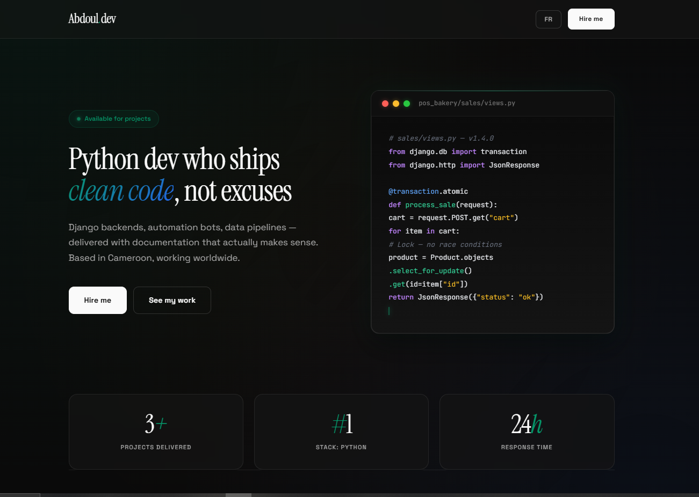

# 🐍 Abdoul.dev — Personal Portfolio

> Python Developer who ships clean code, not excuses.

[](https://abdoul77aziz.github.io/Abdoul.dev/)
[](https://www.python.org/)
[](LICENSE)



## 🎯 About

This is my personal portfolio website showcasing my work as a Python Developer specializing in **Django backends, automation bots, and data pipelines**.

Built with pure HTML, CSS, and JavaScript — no frameworks, no build tools, no dependencies. Just clean, fast, and accessible code.

🌐 **Live site**: [abdoul77aziz.github.io/Abdoul.dev](https://abdoul77aziz.github.io/Abdoul.dev/)

## ✨ Features

- 🌓 **Automatic Dark/Light mode** — respects system preferences
- 🌍 **Bilingual support** — English / French toggle
- 📱 **Fully responsive** — mobile-first design
- ⚡ **Zero dependencies** — pure HTML/CSS/JS
- 🎨 **Premium design** — glassmorphism, gradients, smooth animations
- 💻 **Live code preview** — animated Python code in the hero section
- ♿ **Accessible** — WCAG compliant, keyboard navigation, skip links
- 🔍 **SEO optimized** — structured data (JSON-LD), Open Graph tags
- 📬 **Working contact form** — powered by Formspree

## 🚀 Projects Showcased

| Project | Stack | Description |
|---------|-------|-------------|
| [POS Bakery](https://github.com/abdoul77aziz/POS-Bakery-Github) | Django 5, SQLite, Bootstrap 5 | Full-featured POS with role-based auth, real-time inventory, multi-payment support |
| [School Grading System](https://github.com/abdoul77aziz/School-Grading-System) | Django 5, ReportLab, openpyxl | Grade management with 4 scales (FR/US/UK/Africa), PDF/Excel export |
| [Weekly Meal Planner](https://github.com/abdoul77aziz/meal-planner) | Streamlit, Pandas, openpyxl | 7-day meal planner with dietary filters and shopping list generation |

## 🛠️ Tech Stack

- **HTML5** — semantic markup
- **CSS3** — custom properties, grid, flexbox, glassmorphism
- **Vanilla JavaScript** — no frameworks
- **Google Fonts** — Space Grotesk, Instrument Serif, JetBrains Mono
- **Formspree** — form backend for contact form
- **GitHub Pages** — hosting & deployment

## 📦 Local Development

No build process required! Just open the file:

```bash
# Clone the repository
git clone https://github.com/abdoul77aziz/Abdoul.dev.git
cd Abdoul.dev

# Open in your browser
open index.html  # macOS
start index.html # Windows
xdg-open index.html # Linux
```

Or use any local server:

```bash
# Python 3
python -m http.server 8000

# Node.js (with npx)
npx serve

# Then visit http://localhost:8000
```

⚙️ Configuration

Contact Form (Formspree)

1. Sign up at formspree.io
2. Create a new form
3. Replace REMPLACEZ_PAR_VOTRE_ID_FORMSPREE in index.html with your form ID:

```html
<form action="https://formspree.io/f/YOUR_FORM_ID" method="POST">
```

Social Links

Update these placeholders in index.html:

```html
<!-- GitHub profile -->
<a href="https://github.com/abdoul77aziz">

<!-- LinkedIn -->
<a href="https://www.linkedin.com/in/YOUR_LINKEDIN">

<!-- Freelancer -->
<a href="https://www.freelancer.com/u/atonf0abdulAzz">
```

📂 Project Structure

```
Abdoul.dev/
├── index.html          # Main portfolio file (single-page app)
├── README.md           # This file
└── LICENSE             # MIT License
```

🎨 Design Highlights

* Color palette: Emerald (#059669), Orange (#f97316), Blue (#2563eb)
* Typography: Space Grotesk (body), Instrument Serif (headings), JetBrains Mono (code)
* Effects: Glassmorphism, smooth transitions, gradient accents
* Animations: Typewriter code preview, pulse effects, hover transforms

🌐 Deployment

The site is automatically deployed via GitHub Pages from the main branch.

Every push to main triggers a new deployment at:
👉 https://abdoul77aziz.github.io/Abdoul.dev/

📫 Contact

* 📧 Email: via contact form
* 💼 LinkedIn: atonfo-abdoul-aziz
* 🐙 GitHub: @abdoul77aziz
* ⭐ Freelancer: @atonf0abdulAzz

📄 License

This project is open source and available under the MIT License.

---

```
<div align="center">

Built with ❤️ by Abdoul Aziz Atonfo
Python Developer · Django · Automation · Data Pipelines
📍 Douala, Cameroon · 🌍 Working worldwide
</div>
```